Provision an OCI compute instance using the OCI console
---------------------------------------------------

Overview
--------
This documentation demonstrates a step-by-step process of provisioning an Oracle Cloud Infrastructure instance using the OCI console

Deployment Steps
-----------------
1. Navigating to Compute instances
   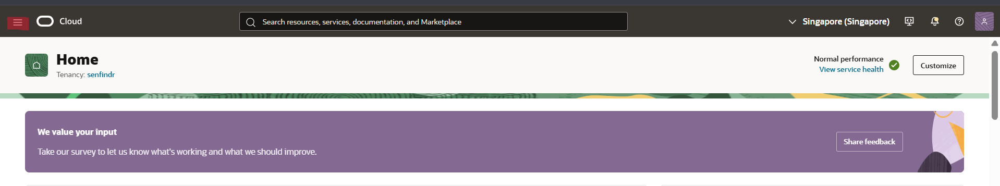Log in to the console using the credentials and open the toggle menu at the top left
   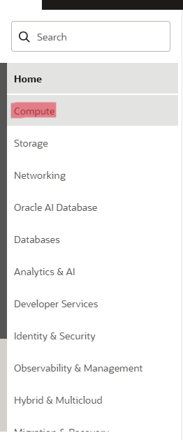When you see the drop-down navigation menu, you will see a submenu labelled "Compute" After clicking on that, it will load another menu. From there, you can direct to the "Instances" section (figure 3)
   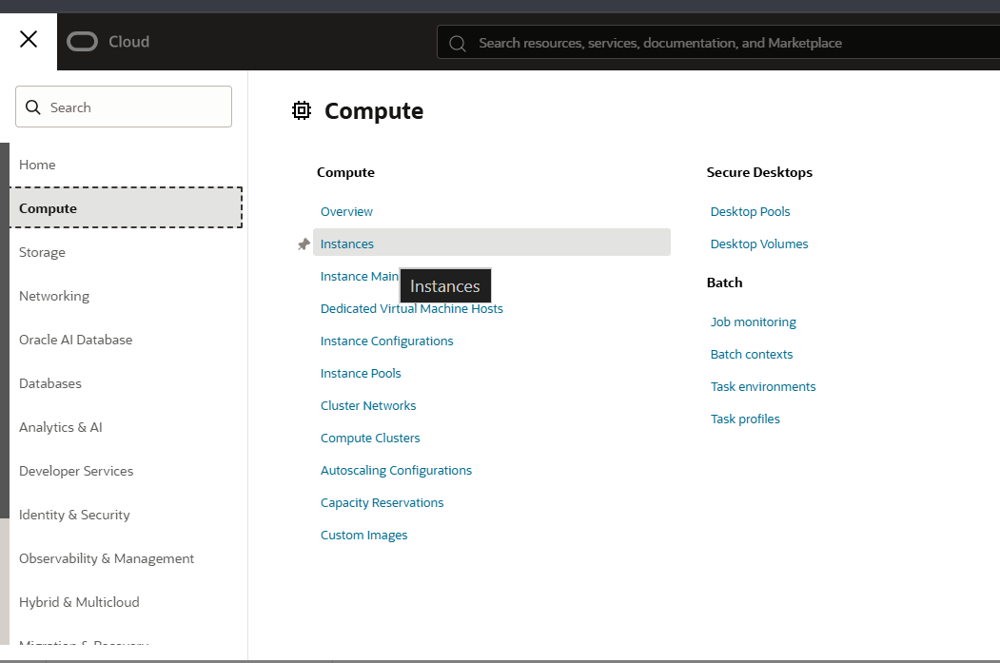
   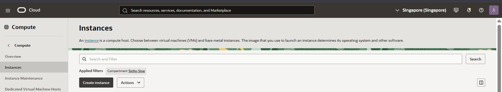After directing to the instance section in the console, below the search bar, you will see after applied filter section "Compartments" section. Make sure you are operating within the correct targeted compartment; otherwise, you can change the compartment from the dropdown when you click it.

2. Basic Information & Placement
   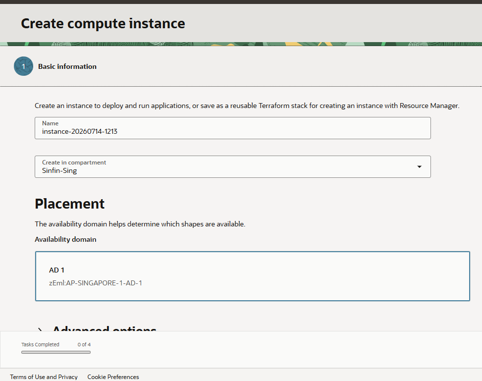 In this step, we define the main identity and the main physical where we provision the instance.
   Name: Assign a descriptive name like "SINFIN_PROD_APP" depending on the resource usage.
   Compartment: to get a proper access control and to ensure the logical placement, assign the compartment you want to place in the compartment section
   Availability Domain: This determines the physical data centre within the Singapore region where the server will reside.

   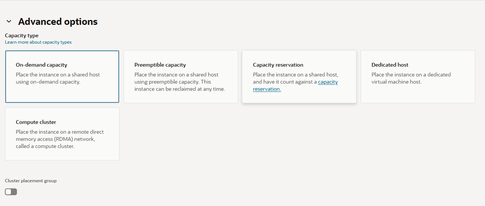 Advance placement option and the Capacity type
   Capacity Type: "On-demand capacity" is the default when it comes to provisioning an instance. This is to ensure standard billing and availability without requiring upfront capacity reservations.

   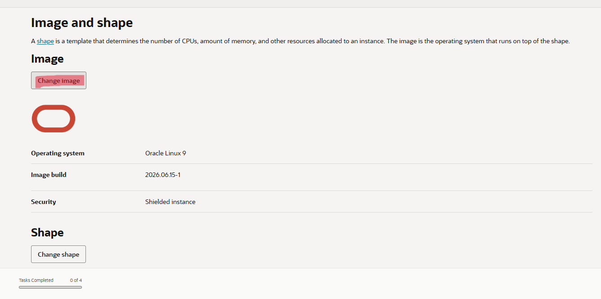 Configuring the Operating System
   Change Image: This button is used to open the image section

   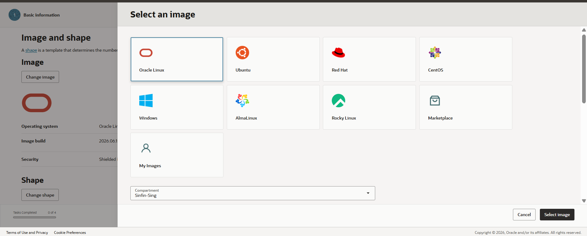 Selecting the OS Platform
   Within the OCI platform, these are the image catalogues provided by Oracle. You can select the image according to the requirement.

   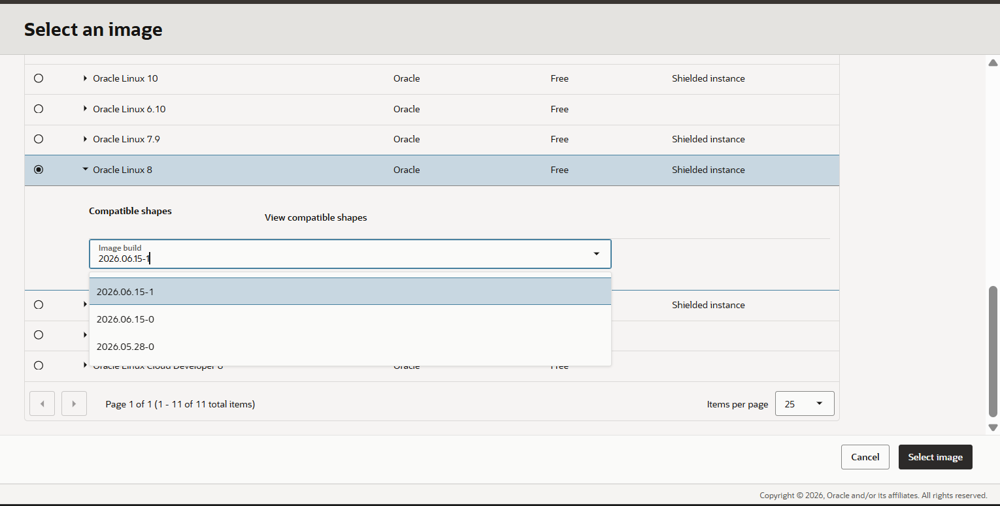 Selecting the compatible shapes
   Select the radio button to choose the image
   Open the "Image Build" dropdown and select the date to make the deployment
   For the final part, click on the "Select Image" button.

   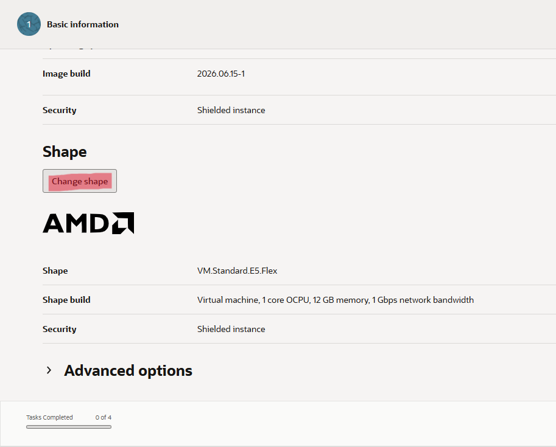 Initiating the compute shape 
   This is where we have to select the main resources of the VM(CPU, memory, and network bandwidth)
   Change Shape: To modify the default hardware allocations

   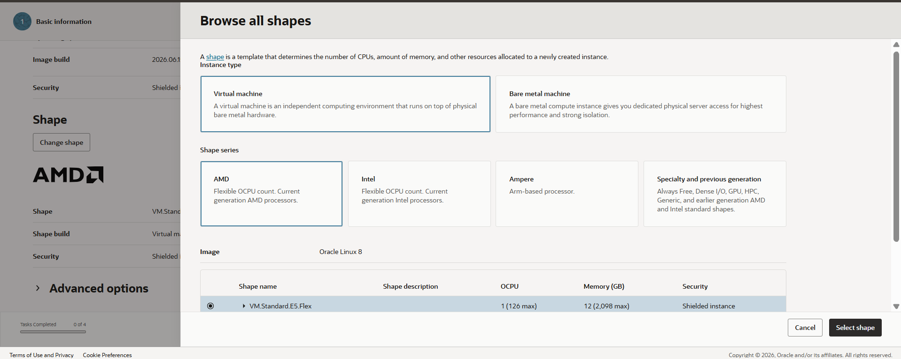 Configuring the Flexible Compute Shape
   Instance Type: Select "Virtual Machine" to utilise a compute VM
   Shape Series: Choose the "AMD" processor for its balanced performance and cost efficiency.
   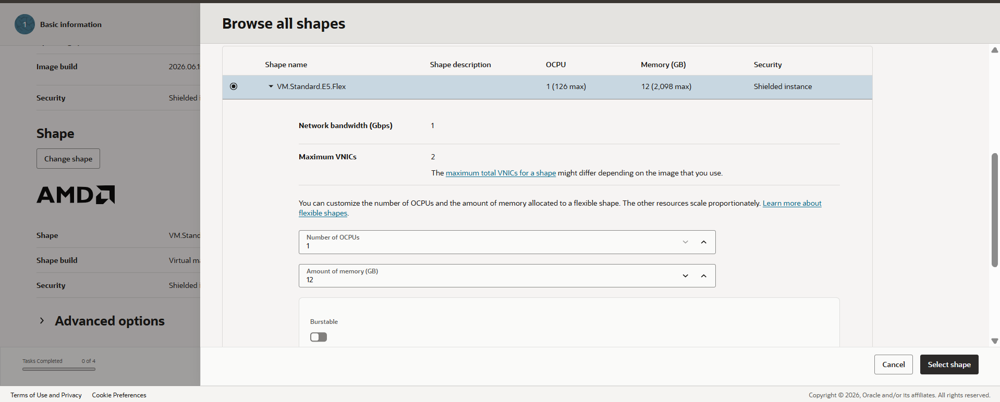Shape Configuration: Selected the "VM.Standard.E5.Flex" shape for the baseline of 1 OCPU and 12GB of memory allocation.

3. Networking Configuration
   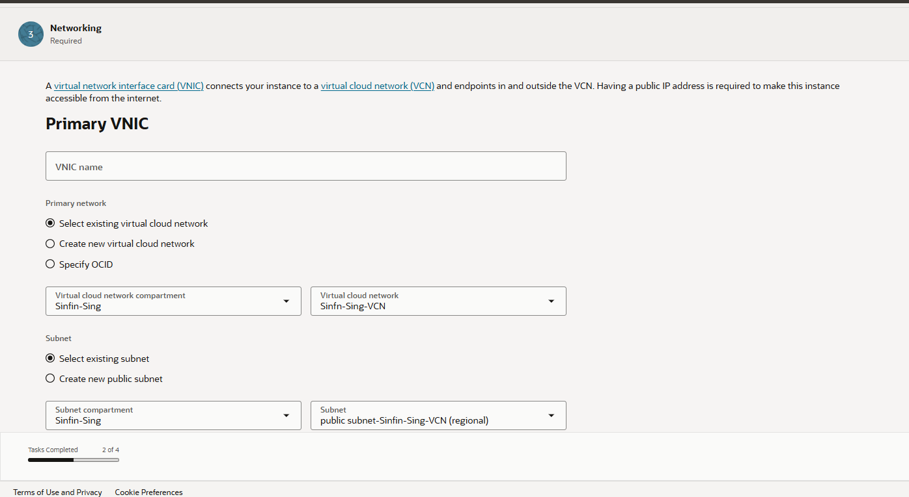 In this step, the instance is attached to an existing Virtual Cloud Network and placed into specific routing tiers
   Primary Network: Select an existing VCN within the compartment.
   Subnet: Deploy the instance to an existing regional subnet based on the requirement("public" or "private") according to the user requirement.

   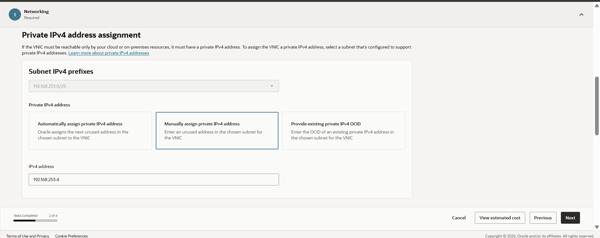 Configure the private IPV4 assignment
   Assign method: Here, I have given the method "Manually assign IPv4 address" since I have a specific IP that needs to be assigned by the customer to this specific VCN. You can also select either of these three options: the "automatically assign" option, which assigns the IPv4 address automatically according to the subnet range.
   IPv4 address: Assign the CIDR block for the private subnet here.

4. Configure the security (SSH Key)
   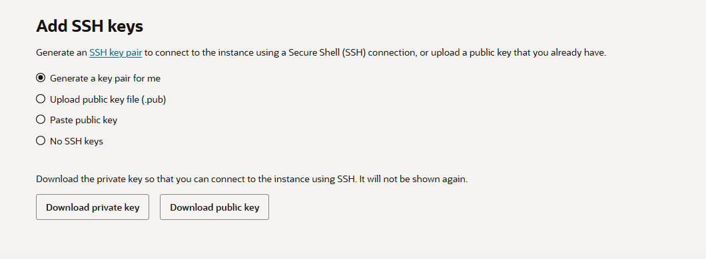 Oracle Linux requires SSH keys for secure access and passwordless authentication. For that, we require a key set generated for this specific instance.
   Key Generation: "Generate a key pair for me" 
   Download both the key pairs, as we need the private key to access this server and the public key is automatically injected into the VM's "~/.ssh/authorized_keys" file during the generation.
   If you have a generated key pair with you, you can paste the public key here with the "paste public key" option.

5. Configure Storage (Boot Volume)
   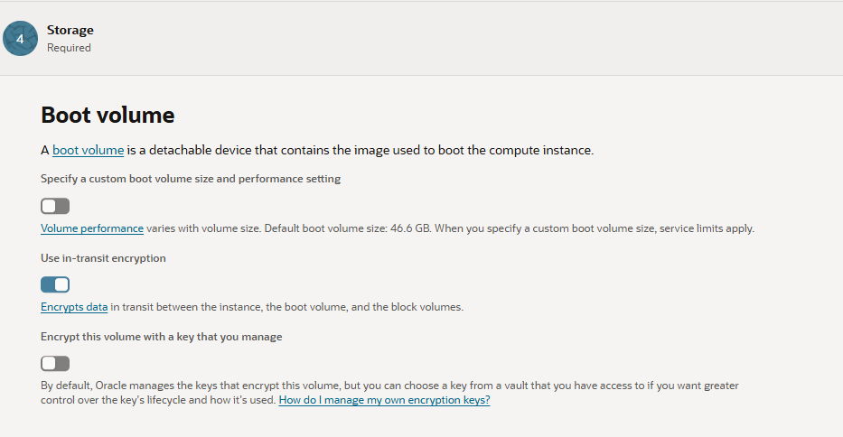 Final configuration step defines the primary storage attached to the instance, which contains the os and the baseline configurations
   Boot Volume Size: default retains 47GB, you can toggle the button and specify according to what you want to allocate.
   Encryption in Transit: enabled "Use in-transit encryption" to ensure the data is travelling over the internal network between the compute instances and the block storage securely.
   Key Management: Utilised default Oracle-managed keys, leaving custom key management off.  

   Configure Storage (Block Volume)
   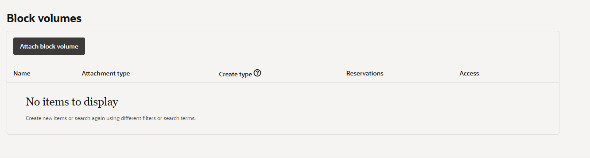 Apart from the boot volume that contains the OS, here we can provision a secondary storage to contain the raw data, such as database datafiles, etc.
   Initiating Attachment: Click on the "Attach block volume" button
   Volume Creation: 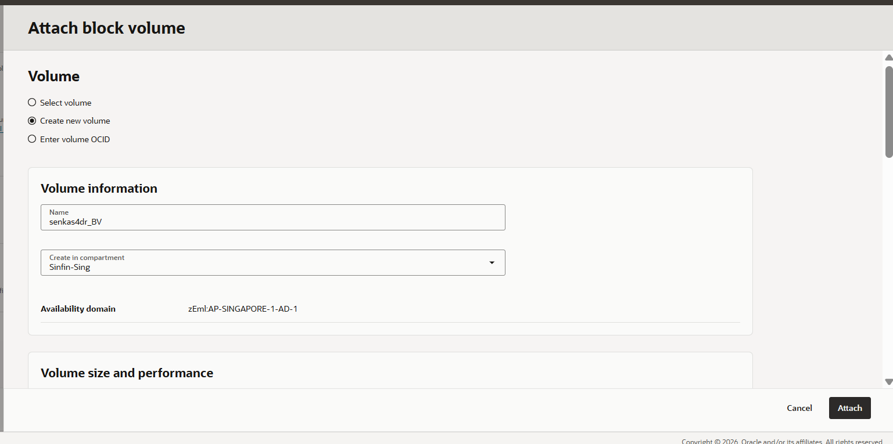. Since I don't have any Block volume created for this instance, I am going to create one here using the "Create new volume" option. Assign the name and the compartment where your block volume should reside.
   Sizing and Performance: 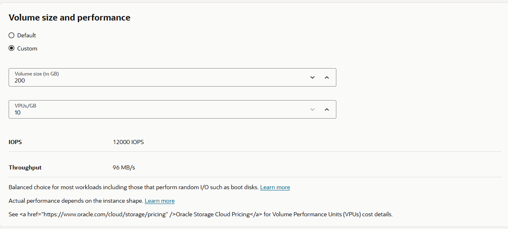. Enter a custom volume size "200GB added here" and the performance tier was tuned to "10 VPU/GB"(Balanced State), which provisions 12,000 IOPS and 96 MB/s of throughput to handle random I/O efficiently. 
   Attachment Type & Security: 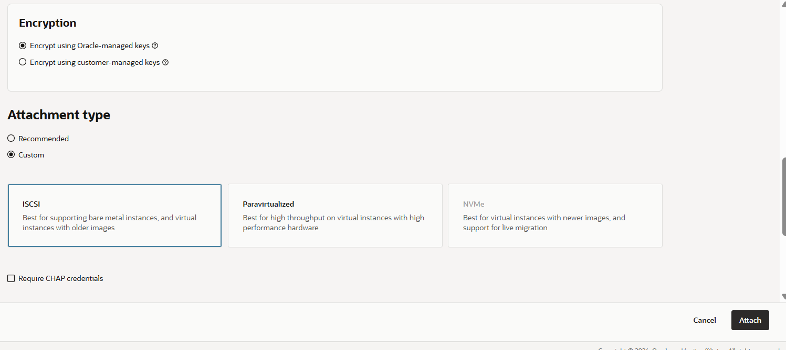 Selected "Paravirtualized" as this is an easy option because the hypervisor automatically mounts the drive to the OS. 

6. Review
   At last, you get a review page for viewing the details of the assigned specs for the VM.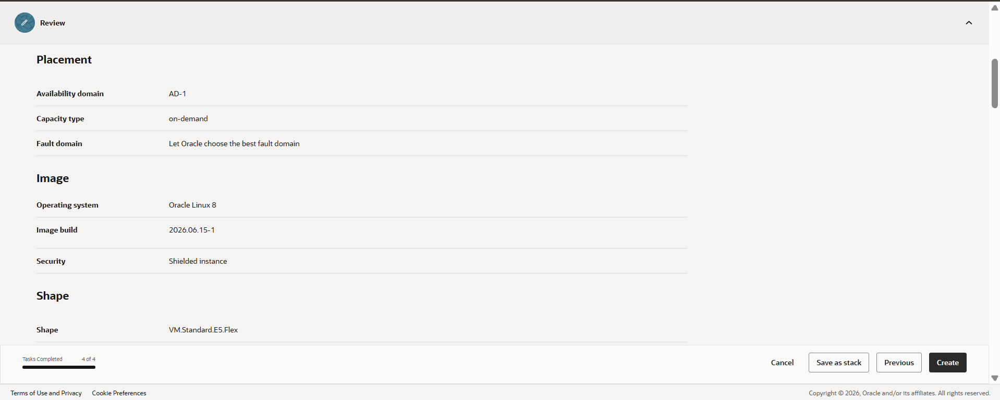   
   

   
